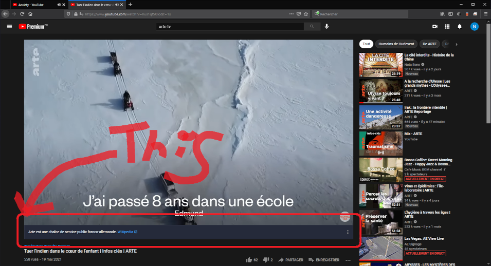

# ClearClarify

Remove the clarify banner from youtube.  
  
Recently, even using a premium account, youtube added a box containing additional content over the videos.  
There is no way to remove it off course, you must see the ad while paying for not.  
Fortunately there is an easy way to remove them... writing an extension, then I did it in pure JavaScript and CSS. You can view the source code here.

## How to install?

You can get it on the [official add-ons page for the mozilla project](https://github.com/cGIfl300/ClearClarify) or download it directly from the GitHub repository.  
✨ I hope you will adopt and enjoy this new extension. ✨
